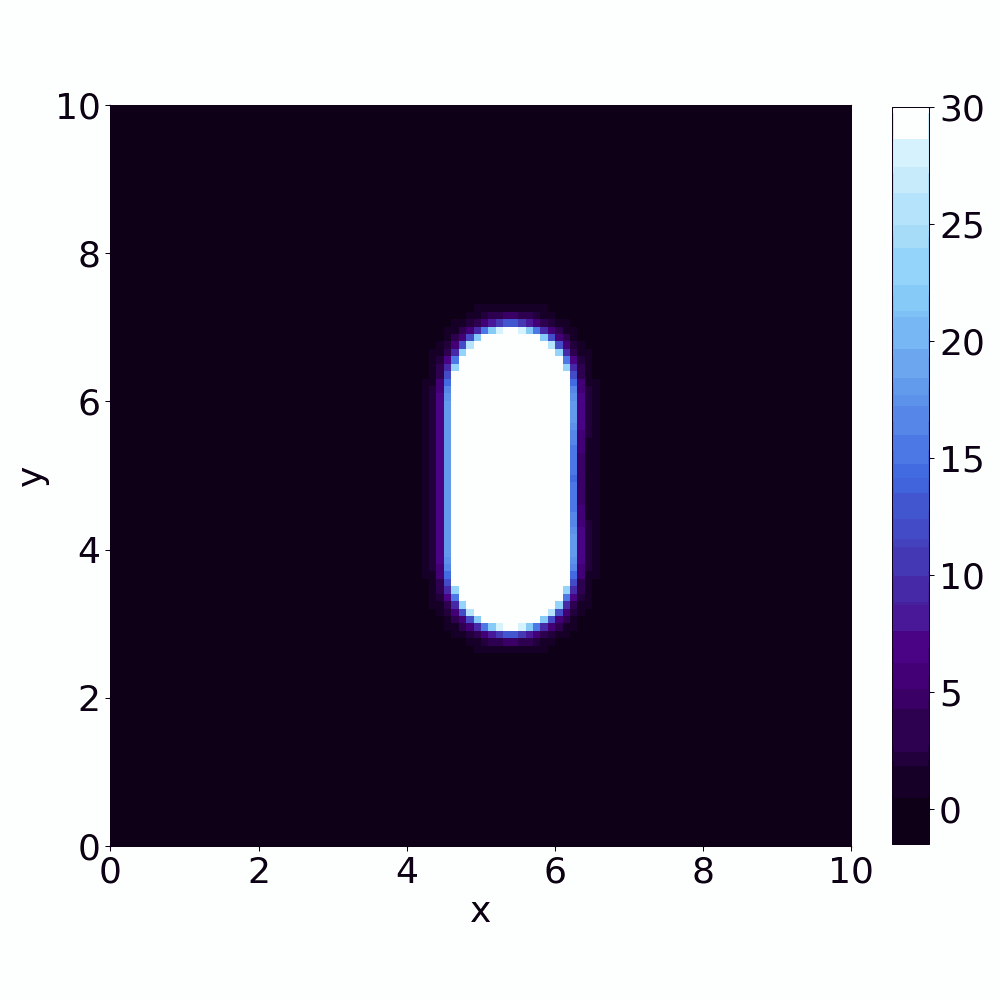
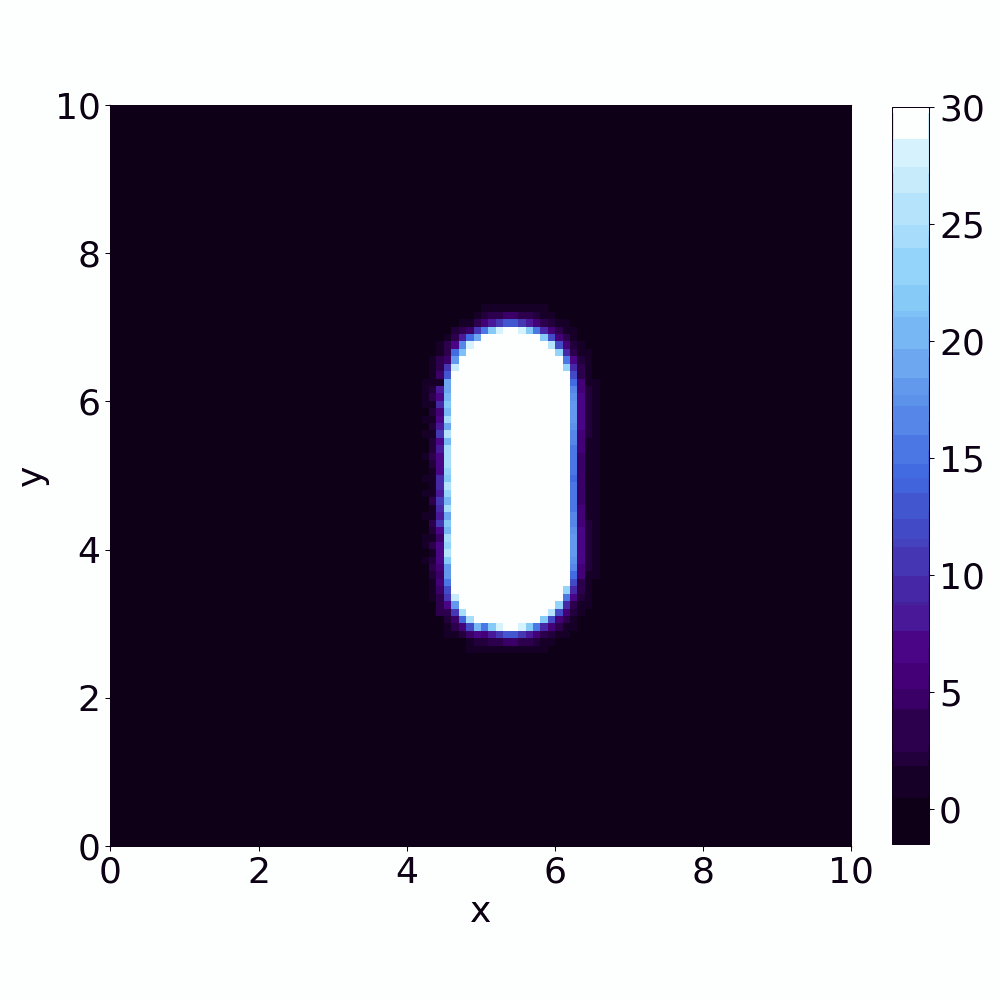

# MultiscaleRD

This repository contains the code accompanying the paper:  
**[[1] Open Reaction-Diffusion Systems: Bridging Probabilistic Theory and Simulation Across Scales](https://arxiv.org/abs/2404.07119)** (submitted) by M. J. del Razo and M. Kostré ([arXiv](https://arxiv.org/abs/2404.07119)).

The implementation builds on algorithms from our previous work:  
**[[2] Coupling Particle-Based Reaction-Diffusion Simulations with Reservoirs Mediated by Reaction-Diffusion PDEs](https://epubs.siam.org/doi/10.1137/20M1352739)** SIAM Multiscale Modeling and Simulation 19(4), 1659–1683, by M. Kostré, C. Schütte, F. Noé, and M. J. del Razo ([arXiv](https://arxiv.org/abs/2006.00003)).

All algorithms from both papers are implemented in this repository. The algorithms from [1] offer significant efficiency improvements over those originally presented in [2], and we have included new examples to demonstrate their validity.

## Overview

In this code, we implement hybrid schemes that couples particle-based reaction-diffusion simulations with spatially and time-dependent reservoirs mediated by reaction-diffusion PDEs. It solves the reaction-diffusion PDE using a finite difference scheme with a Crank-Nicolson integrator, and implements particle-based reaction-diffusion simulations based on the Doi model, similar to how it is done in [ReaDDy2](https://readdy.github.io/).  
The hybrid scheme consistently couples the particle-based simulation to the PDE-mediated reservoir. We verify the scheme using **three examples**:

1. **Diffusion process in 1D**: .
2. **Diffusion process with a proliferation reaction**: This can be generalized to systems with zeroth- and/or first-order reactions.  (`multiscaleRD/FD_Proliferation.py` and `multiscaleRD/Coupling_Proliferation.py`)
3. **Lotka-Volterra (predator-prey) reaction-diffusion process**: This can be generalized to systems with up to second-order reactions. (`multiscaleRD/FD_LV.py` and `multiscaleRD/Coupling_LV.py`)
4. **SIR (susceptible, infected, recovered) reaction-diffusion process**: This can be generalized to systems with up to second-order reactions. (`multiscaleRD/FD_SIR.py` and `multiscaleRD/Coupling_SIR.py`)

## Sample Solutions

### Lotka-Volterra (LV)

We show videos of the solution of a two-dimensional Lotka-Volterra (predator-prey) reaction-diffusion system. The videos on the left show the reference simulation obtained with a finite-difference scheme. The videos on the right show the results of the hybrid simulation using the explicit coupling schemes first presented in [2], where the left half of the domain corresponds to the average concentration over several particle-based simulations, and the right half corresponds to the concentration modeled by the PDE-mediated reservoir.

**Prey concentration**

 

**Predator concentration**

 

### The spatial SIR model

We show videos of the solution of a simulation of SIR (susceptible, infected and recovered) dynamics with spatial resolution. The videos on the left show the reference simulation obtained with a finite-difference scheme. The videos on the right shows the results of the hybrid simulation using the new and more efficient coupling schemes from [1], where the left half of the domain corresponds to the average concentration over several particle-based simulations, and the right half corresponds to the concentration modeled by the PDE-mediated reservoir.

**Susceptible agents concentration**

 

**Infected agents concentration**

 

**Recovered agents concentration**

## Requirements

- Python 3.x
- Numpy 1.24.2
- Matplotlib 3.63 or above
- Pickle (part of Python standard library)
- Git (to clone this repository)

## How to run this code?

1. Clone this repository to your local machine:  
   `git clone https://github.com/MargKos/multiscaleRD.git`
2. (Optional) Modify the default mathematical and numerical parameters for the finite difference scheme and particle-based simulation in `multiscaleRD/Parameters_(example).py`.
3. Solve the reaction-diffusion PDE for each example by running the finite difference code (`multiscaleRD/FD_(example).py`). This will generate the reference solution(s) and reservoir.
4. Run multiple particle-based simulations by executing `multiscaleRD/Coupling_(example).py`, preferably across multiple computers. For each time-step, store the locations of particles from each simulation. (we recommend to store the names on the text file 'Protokol')
5. Use `multiscaleRD/Discretization_(example).py` to calculate the average over the particle-based simulations.
6. Run `multiscaleRD/Plot_(example).py` to plot the concentration.
7. Use `multiscaleRD/CompareMean_(example).py` to compare the number of particles across the particle-based domain and to compare the computational time.
8. To calculate the Jensen-Shannon Divergence (JSD), run `multiscaleRD/JSD_Run_(example).py` and plot it using `multiscaleRD/JSD_Plot_(example).py`.

## Folder Organization

- `multiscaleRD/Parameters_(example).py`: Contains mathematical parameters (reaction rates, diffusion coefficients), numerical parameters (time-step size, grid size, boundary size), and computational parameters (number of parallel simulations).
- `multiscaleRD/FD_(example).py`: Implements the finite difference scheme for the reaction-diffusion equation with homogeneous Neumann boundary conditions.
- `multiscaleRD/Coupling_(example).py`: Contains the hybrid algorithm.
- `multiscaleRD/Injection.py` and `multiscaleRD/Reaction.py`: Contain functions for the injection and reaction procedures used in `multiscaleRD/Coupling_(example).py`:
  - `multiscaleRD/Reaction_(example).py` implements particle-based reaction-diffusion simulations (up to second-order reactions), such as proliferation (A → 2A), degradation (A → 0), and diffusion of particles modeled by the Euler-Maruyama scheme for a) LV and proliferation examples b) SIR example. These functions return, for example, lists of newly created particle positions.
- The folder `./Simulations`, which is located in SCRRATCH folder: Contains all the particle trajectories resulting from the hybrid scheme simulations (`multiscaleRD/Coupling_(example).py`).
The second and third example are using Reaction_LV and Injection_LV functions, where SIR uses Reaction_SIR and Injection_SIR functions
- The folder `multiscaleRD/Solutions`: Contains solutions of the reaction-diffusion PDE and the average over particle-based simulations from `multiscaleRD/Simulations`. These files are used for plotting or analysis in `multiscaleRD/Plot_(example).py`.
- The folder `multiscaleRD/Plots` contains plots, i.e. results
- The folder `multiscaleRD/Videos` contains video, which are generated with `Video_(examnple).py`
  
## Notes on Code Notation

- The reference solutions of the preys/susceptible species are denoted by "1", the solutions of the predators/infected by "2", and the recovered by "3".

## License

This project is licensed under the MIT License. See the [LICENSE](LICENSE) file for details.
